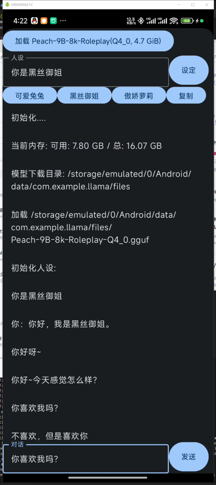

# 原始模型

使用的模型：https://huggingface.co/ClosedCharacter/Peach-9B-8k-Roleplay

# 运行结果

# 使用的工程框架 llama.cpp

## 工程编译过程，直接可以使用Android Studio编译

## 其中的llama直接引用了 llama.cpp的CPP工程

# 模型转换过程

使用llama.cpp 中提供的 convert_hf_to_gguf.py 
将 hf模型转换为 gguf的格式

然后修改token的相关处理，对system user assistant 对话过程进行修改适配

